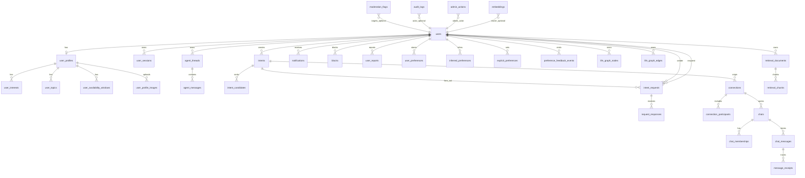

# Database ERD (Core Runtime)

The diagram below is intentionally focused on high-value runtime entities. Full column details remain in `prisma/schema.prisma`.

## Notes
- Some relations are logical (by foreign-key ID fields) even if Prisma does not declare every relation object.
- Archive tables (`chat_messages_archive`, `audit_logs_archive`) are omitted from the diagram for readability.
