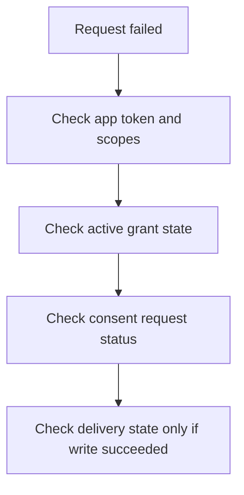

# Consent And Auth Troubleshooting

Use this guide when a protocol request fails and you need to know whether the problem is:

- app authentication
- missing scopes or capabilities
- missing delegated access
- revoked or stale credentials

## The key distinction

There are two separate gates in OpenSocial:

1. app identity
2. delegated authority

Your app can authenticate correctly and still be blocked from acting on behalf of a user.

## The diagnostic order

## First check: app identity

Inspect the app usage summary first.

Look at:

- recent auth failures
- last token rotation
- last token revocation
- recent grant activity

If the app identity is wrong, nothing else matters yet.

## Second check: delegated access

If authentication succeeds but writes still fail, inspect delegated access.

Typical causes:

- no active grant
- consent request still pending
- revoked grant
- missing capability for the requested action
- only modeled-only grants exist for the app

Important rule:

> A consent request is not an active grant.

Approval is what turns a pending request into executable delegated access.

Important rule:

> Not every active grant is executable delegated access.

Current execution model:

- `user` subject grants are executable
- `app`, `service`, and `agent` subject grants are modeled-only

So an app can have active grants and still be blocked from acting on behalf of a user.

## Third check: scopes and capabilities

An app may have a valid token but still lack permission for a specific action.

Common examples:

- read-only token trying to dispatch actions
- app with `actions.invoke` but without `intent.write`
- app with request capability but no delegated authority for the acting user

## Do not confuse auth failures with delivery failures

If the write never succeeded, this is not a replay problem.

Only move into queue or replay debugging after:

- the request is authenticated
- delegated access is valid
- the write succeeded at the protocol layer

## Recovery references

For delivery and replay issues, use:

- [Event subscriptions and replay](./protocol-event-subscriptions-and-replay)
- [Delivery recovery](./protocol-operator-recovery)

For first-time setup, use:

- [App registration and tokens](./protocol-app-registration-and-tokens)
- [Partner quickstart](./protocol-partner-quickstart)
