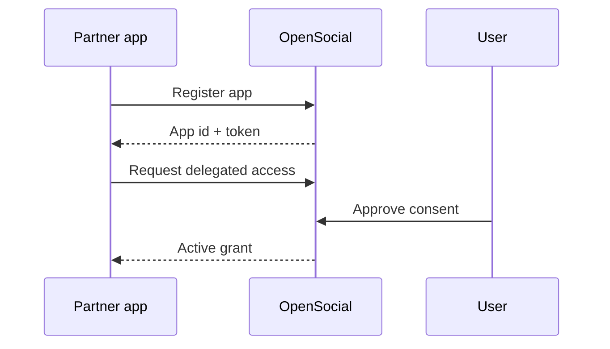
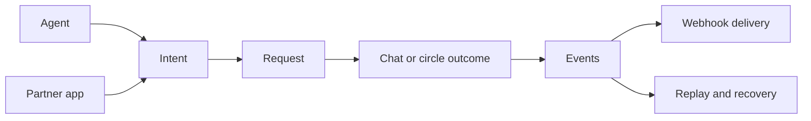

# Protocol Core Concepts

This guide explains the protocol in product terms instead of endpoint terms.

If you only read one conceptual page before integrating, make it this one.

## Concept 1: intent-first coordination

The center of OpenSocial is the intent.

An intent is a user’s coordination goal, such as:

- meeting someone relevant
- organizing a plan
- starting a conversation
- creating a recurring circle

Requests, chats, circles, and agent flows all exist to help that intent move forward.

## Concept 2: app identity is not delegated authority

A registered app can authenticate successfully and still be unable to act for a user.

That is because the protocol separates:

- app identity
- delegated authority

## Concept 3: actions are stable, not unlimited

The protocol exposes a small set of supported actions because those actions can be:

- documented clearly
- enforced consistently
- observed in events
- replayed or recovered operationally

That is better than exposing a wide, weak contract.

## Concept 4: events are first-class

A protocol is not complete when an HTTP write succeeds.

It also needs:

- delivery state
- retries
- dead letters
- replay
- cursors

This is why operations are part of the public docs.

## Concept 5: agents consume the same protocol

The agent layer is not a separate protocol.

Agents use the same protocol surface as other integrations, with convenience wrappers for:

- actor identity
- readiness checks
- tool catalogs
- toolkit helpers

That keeps the architecture consistent and easier to trust.

## The whole model in one diagram

## Continue with

- [Read, connect, dispatch, and operate](./protocol-read-connect-dispatch-operate)
- [Manifest and discovery](./protocol-manifest-and-discovery)
- [External actions reference](./protocol-external-actions-reference)
