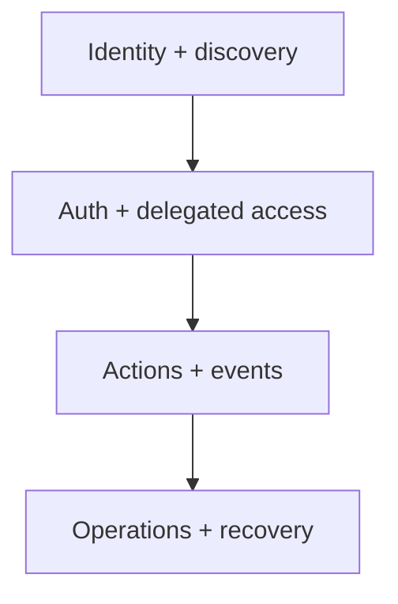
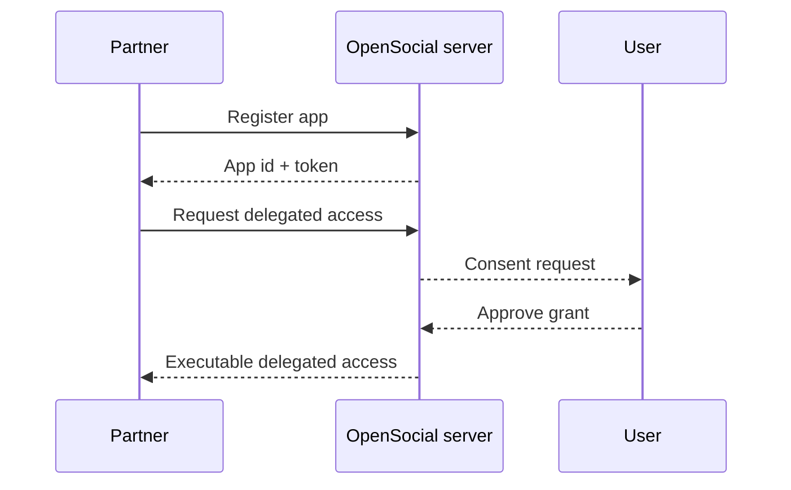

# Protocol Core Concepts

This page explains the protocol in the language you need before writing integration code.

If you skip this page, the rest of the SDK can feel like a list of endpoints. The point here is to make the shape obvious.

## The protocol has four layers

1. identity and discovery
2. auth and delegated access
3. actions and events
4. operations and recovery

## 1. Identity and discovery

Every integration should start by learning what server it is talking to.

That happens through:

- manifest
- discovery

Manifest tells you what kind of protocol server this is.

Discovery tells you what resources, actions, and operational routes the server is exposing.

This is why read-first bootstrap matters so much.

## 2. Auth and delegated access

There are two different ideas here:

- app identity
- delegated authority

Your app can be registered and authenticated without automatically being allowed to act for a user.

For user-scoped actions, you also need delegated access.

## 3. Actions and events

The protocol does not expose arbitrary mutation.

It exposes narrow coordination actions.

Today that surface is centered on:

- intent lifecycle
- request lifecycle
- chat send
- circle create or membership actions

Every useful write should produce a stable event trail.

That lets integrations operate through:

- direct responses
- webhook delivery
- replay

## 4. Operations and recovery

A protocol is not finished when the happy path works.

It also needs:

- delivery visibility
- replay cursors
- dead-letter recovery
- queue health

That is why operations are part of the public docs rather than an internal-only topic.

## Core resources

These are the main nouns in the protocol:

| Resource | Meaning |
| --- | --- |
| `app` | A registered third-party integration identity |
| `grant` | Delegated authority tied to scopes and consent |
| `intent` | A coordination objective initiated in the network |
| `request` | A specific invitation or proposal tied to an intent |
| `chat` | A live conversation surface |
| `circle` | A recurring or group coordination container |
| `event` | A replayable protocol fact |
| `webhook delivery` | A concrete outbound delivery attempt |

## Core verbs

The protocol is also easier to understand if you think in verbs:

- discover
- register
- authorize
- read
- dispatch
- subscribe
- replay
- recover

If a proposed integration pattern does not fit those verbs, it is probably leaning on the wrong abstraction.

## What the protocol deliberately excludes

OpenSocial does not expose a public contract for:

- feed generation
- posts
- follow graphs
- likes
- timeline ranking

Those may exist in some product systems someday, but they are outside the current protocol purpose.

## The shortest mental model

If you only remember one thing, use this:

> OpenSocial protocol is a coordination layer with explicit auth, narrow writes, replayable events, and operational recovery.

## Continue in this order

1. [Protocol overview and exclusions](./protocol-overview-and-exclusions)
2. [Manifest and discovery](./protocol-manifest-and-discovery)
3. [App registration and tokens](./protocol-app-registration-and-tokens)
4. [External actions reference](./protocol-external-actions-reference)
