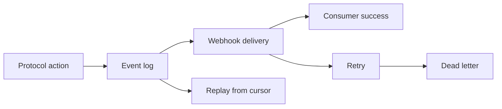

# Event Subscriptions And Replay

This guide covers the operational side of the protocol event model:

- subscribing to events
- receiving webhook deliveries
- inspecting delivery state
- replaying failed work
- resuming from a cursor

## Why this matters

The protocol is not only an HTTP write surface.

It is also a recoverable event surface.

That matters because production integrations need a way to:

- catch up after downtime
- recover from transient delivery failures
- inspect dead letters
- rebuild downstream state safely

## The delivery model

## Subscribe to events

Create webhook subscriptions only for the event families your integration actually handles.

That keeps your consumer smaller, safer, and easier to recover.

Typical families include:

- intent events
- request events
- chat message events
- circle events

## Inspect delivery state

When a webhook does not arrive or downstream state looks stale, inspect delivery state before replaying anything.

The key questions are:

- is the delivery queued?
- is it retrying?
- is it dead-lettered?
- is the queue draining?
- is the consumer cursor actually caught up to the event log?

Queue health alone is not enough.

A delivery stream can look healthy while a downstream consumer still lags behind the latest event cursor.

Operationally, inspect both:

- delivery attempt state
- replay cursor lag

## Replay options

OpenSocial supports three different recovery shapes:

1. replay one delivery
2. replay dead letters in batch
3. replay event history from a stored cursor

Use the narrowest option that solves the problem.

## Recommended recovery order

1. inspect a delivery
2. replay a single delivery if the issue was isolated
3. replay dead letters in batch if the issue was systemic
4. replay from a cursor if you need to reconstruct downstream state

## Verification resources

- [Webhook consumer](./protocol-webhook-consumer)
- [Delivery recovery](./protocol-operator-recovery)
- [Production readiness checklist](./protocol-production-readiness-checklist)
