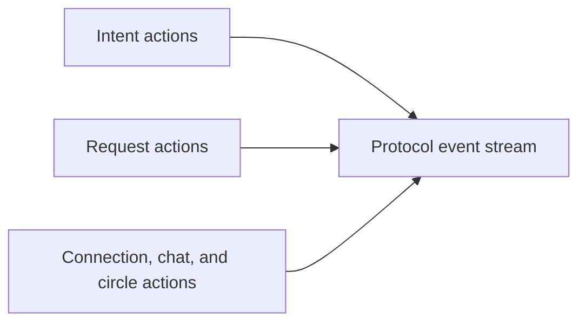

# External Actions Reference

This is the authoritative reference for the current public write surface.

The actions here are the stable coordination primitives exposed by the protocol today.

## Shared requirements

Every write action requires:

- valid app authentication
- the `actions.invoke` scope
- the relevant capability
- delegated authority when the action is user-scoped

If any of those are missing, the action should be expected to fail.

Current delegated execution model:

- executable today: `subjectType=user`
- modeled-only today: `subjectType=app|service|agent`

That means a non-user grant may still appear in auth or usage diagnostics without making a delegated write executable.

For auth debugging, use [Consent and auth troubleshooting](./protocol-consent-and-auth-troubleshooting).

## Action families

## Intent actions

### `intent.create`

Creates a new coordination intent for the acting user.

- Capability: `intent.write`
- Emits: `intent.created`
- Returns: `ProtocolIntentActionResult`

### `intent.update`

Updates the text or active framing of an existing user-owned intent.

- Capability: `intent.write`
- Emits: `intent.updated`
- Returns: `ProtocolIntentActionResult`

### `intent.cancel`

Stops an active intent and closes the intent’s forward motion.

- Capability: `intent.write`
- Emits: `intent.cancelled`
- Returns: `ProtocolIntentActionResult`

## Request actions

### `request.send`

Sends a coordination request for an intent to a target recipient.

- Capability: `request.write`
- Emits: `request.sent`
- Returns: `ProtocolRequestActionResult`

### `request.accept`

Accepts a received request.

- Capability: `request.write`
- Emits: `request.accepted`
- Returns: `ProtocolRequestActionResult`

### `request.reject`

Rejects a received request.

- Capability: `request.write`
- Emits: `request.rejected`
- Returns: `ProtocolRequestActionResult`

## Connection action

### `connection.create`

Creates a direct or group connection for the acting user.

- Capability: `connection.write`
- Emits: `connection.created`
- Returns: `ProtocolConnectionActionResult`

## Chat action

### `chat.send_message`

Sends a message into an existing chat.

- Capability: `chat.write`
- Emits: `chat.message.sent`
- Returns: `ProtocolChatMessageActionResult`

## Circle actions

### `circle.create`

Creates a recurring or group coordination circle.

- Capability: `circle.write`
- Emits: `circle.created`
- Returns: `ProtocolCircleActionResult`

### `circle.join`

Joins a circle or adds a member to it, depending on the flow.

- Capability: `circle.write`
- Emits: `circle.joined`
- Returns: `ProtocolCircleActionResult`

### `circle.leave`

Leaves a circle or removes a member from it, depending on the flow.

- Capability: `circle.write`
- Emits: `circle.left`
- Returns: `ProtocolCircleActionResult`

## Common failure modes

Across the whole write surface, the most common causes of failure are:

- invalid or stale app token
- missing `actions.invoke`
- missing capability for the action family
- no active delegated grant
- only modeled-only grants exist for the app
- resource ownership or membership mismatch

## Related resources

- [Partner quickstart](./protocol-partner-quickstart)
- [Event subscriptions and replay](./protocol-event-subscriptions-and-replay)
- [Agent integration paths](./protocol-agent-integration-paths)
