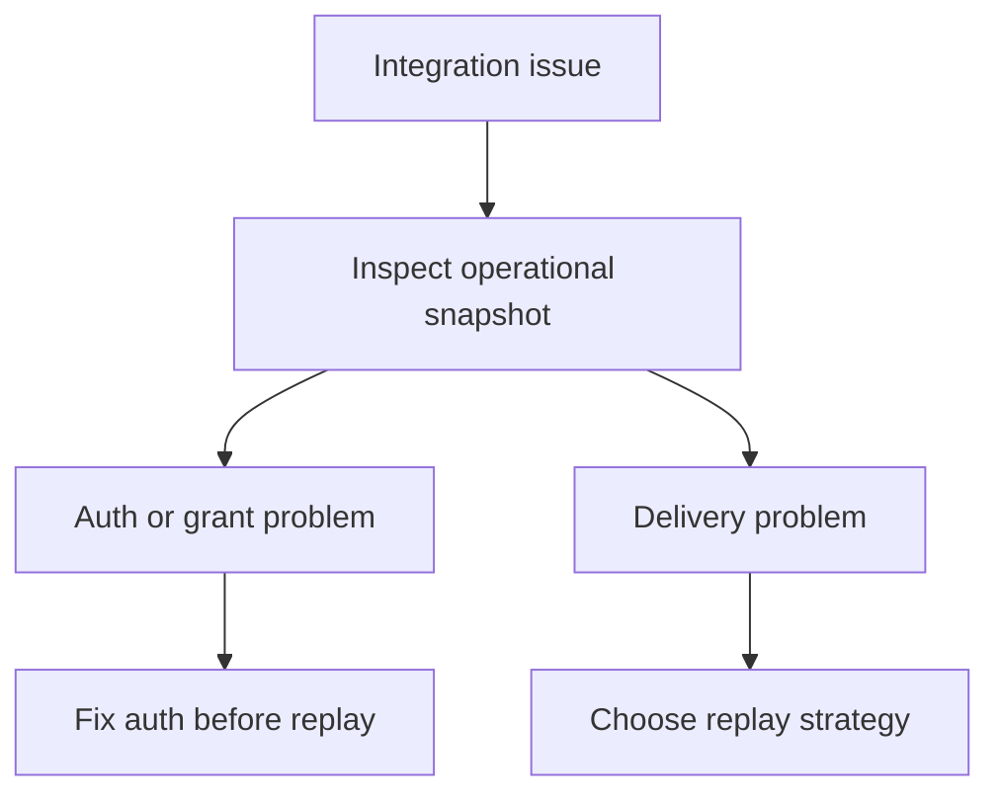

# Operator Recovery

This guide is for the people responsible for keeping a live integration healthy.

It explains how to reason about queue state, dead letters, and replay without turning recovery into guesswork.

## What this page is for

Use this page when you need to answer questions like:

- Is this an authentication problem or a delivery problem?
- Are deliveries stuck, retrying, or dead-lettered?
- Should I replay one item or recover a larger batch?
- Is the queue draining normally?

## Start with diagnosis, not replay

The first step is always to inspect the app’s operational state.

That inspection should tell you whether the primary problem is:

- invalid app auth
- missing delegated authority
- delivery backlog
- dead-letter accumulation

## When to replay a single delivery

Replay one delivery when:

- the underlying bug is fixed
- the failure was isolated
- you know exactly which delivery should be retried

This is the safest recovery path because it limits duplicate downstream work.

## When to replay dead letters in batch

Replay a batch only when the failure was systemic, for example:

- the receiver was down
- signature validation was broken
- a parser bug affected many deliveries

Batch replay is a recovery tool, not a first diagnostic step.

## When to inspect queue health

Queue health matters when you see:

- growing retry counts
- a rising dead-letter count
- queued deliveries aging instead of draining
- inconsistent downstream state after valid writes

Those are operational signals, not product-state signals.

## Practical recovery order

1. Inspect the operational snapshot.
2. Decide whether the issue is auth, grants, or delivery.
3. Fix the underlying cause.
4. Replay one delivery if the failure was isolated.
5. Replay dead letters in batch only when the failure was systemic.

## Related guides

- [Consent and auth troubleshooting](./protocol-consent-and-auth-troubleshooting)
- [Event subscriptions and replay](./protocol-event-subscriptions-and-replay)
- [Webhook consumer](./protocol-webhook-consumer)
