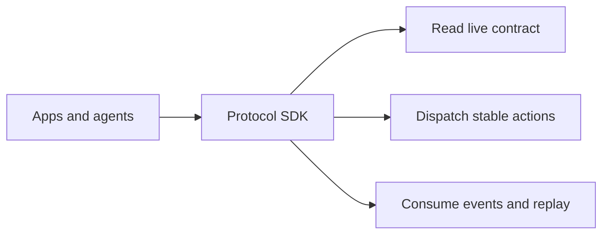
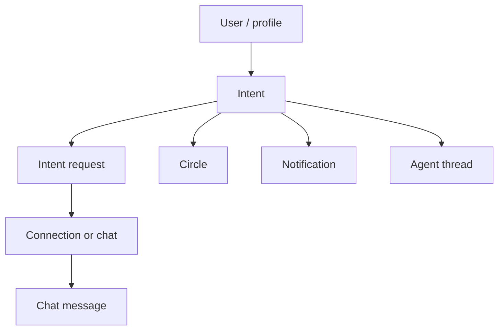

# OpenSocial Protocol Overview And Exclusions

High-level orientation for the OpenSocial protocol surface.

Use it before the action reference or partner examples.

## One-sentence summary

OpenSocial is a coordination-first protocol for apps and agents that need to read state, dispatch stable actions, and operate integrations without private backend access.

## What OpenSocial protocol is

OpenSocial protocol is a coordination-first integration surface extracted from the product we already run.

It is built around the OpenSocial domain:

- identity
- profiles
- intents
- requests
- connections
- chats
- circles
- notifications
- agent threads
- realtime and replayable events

The protocol lets:

- first-party clients
- third-party apps
- partner agents

read state, write approved actions, and subscribe to relevant events without private backend internals.

## What it is not

It is not a generic social-network SDK.

It is not designed around:

- posts
- follows
- feeds
- likes
- generic timeline primitives

Those are outside the supported contract.

If a partner tries to model OpenSocial as a feed or follow graph, they are pointing at the wrong abstraction layer.

## Core integration modes

The protocol surface supports three integration modes:

1. read state
2. write actions
3. subscribe to events

That is the stable mental model for the whole SDK family.

## Why the exclusions matter

The exclusions are not temporary omissions.

They are how the protocol stays:

- narrow
- teachable
- stable
- recoverable

If the public contract tried to expose every product behavior, it would become much harder to operate and much harder for third parties to trust.

## Resource Shape

The core resource model is:

- `user`
- `profile`
- `intent`
- `intent_request`
- `connection`
- `chat`
- `chat_message`
- `circle`
- `notification`
- `agent_thread`
- protocol app registration and webhook resources

These are the primitives the backend and SDK are converging around.

## Resource relationship

## Write Surface

The writable action surface is narrow:

- intent lifecycle
- request lifecycle
- chat send
- circle create/join/leave

Use the detailed reference for those:

- [`/Users/cruciblelabs/Documents/openchat/docs/examples/protocol-external-actions-reference.md`](/Users/cruciblelabs/Documents/openchat/docs/examples/protocol-external-actions-reference.md)

## Event Surface

The event model is also coordination-first.

Examples include:

- intent lifecycle events
- request lifecycle events
- chat message events
- circle lifecycle events
- webhook delivery and failure events

Use the event and replay guide for the operational view:

- [`/Users/cruciblelabs/Documents/openchat/docs/examples/protocol-event-subscriptions-and-replay.md`](/Users/cruciblelabs/Documents/openchat/docs/examples/protocol-event-subscriptions-and-replay.md)

## Auth and Delegated Access

There are two important gates in the protocol:

1. app-level auth
2. delegated grants for user-scoped actions

Partner integrations need to account for both:

- app tokens
- scopes and capabilities
- consent requests
- active grants

Use these guides for the details:

- [Consent and auth troubleshooting](./protocol-consent-and-auth-troubleshooting)
- [Operator recovery](./protocol-operator-recovery)

## SDK Family

The package family is:

- `@opensocial/protocol-types`
- `@opensocial/protocol-events`
- `@opensocial/protocol-client`
- `@opensocial/protocol-server`
- `@opensocial/protocol-agent`

Each package stays narrow:

- `protocol-types`: schemas and shared types
- `protocol-events`: event payloads and event vocabulary
- `protocol-client`: transport-backed protocol calls
- `protocol-server`: helper utilities like webhook verification
- `protocol-agent`: thin agent-oriented wrappers on top of the client

## Choosing the next doc

After this overview, the usual next step is:

- manifest and discovery bootstrap:
  - [Manifest and discovery](./protocol-manifest-and-discovery)
- onboarding flow:
  - [Partner quickstart](./protocol-partner-quickstart)
- writable contract:
  - [External actions reference](./protocol-external-actions-reference)
- operational recovery:
  - [Operator recovery](./protocol-operator-recovery)
- agent integrations:
  - [Agent integration paths](./protocol-agent-integration-paths)
