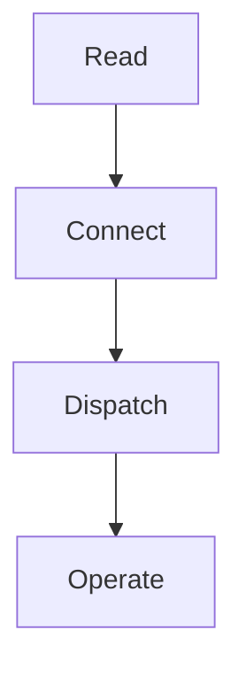
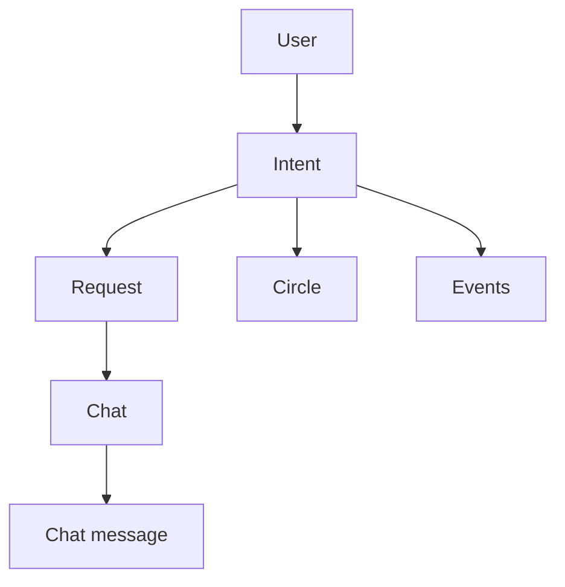

# Protocol Overview And Exclusions

This page explains the public contract at a high level.

Use it before reading the action reference or implementing a client.

## The public shape

OpenSocial exposes a coordination-first protocol for apps and agents.

The stable model is:

1. read state
2. connect with app identity and delegated access
3. dispatch stable actions
4. consume events and recover delivery state

## Core domain objects

The protocol is built around the actual OpenSocial domain:

- `app`
- `grant`
- `intent`
- `request`
- `chat`
- `chat_message`
- `circle`
- `notification`
- `agent_thread`
- `event`

These are the nouns that matter because they map to how the product works for users.

## Core actions

The current public write surface is intentionally narrow:

- intent lifecycle
- request lifecycle
- connection creation
- chat creation and messaging
- circle lifecycle and membership actions

That surface is documented in the [external actions reference](./protocol-external-actions-reference).

## Why the protocol is intentionally narrow

Public protocols become fragile when they mirror every implementation detail.

OpenSocial stays narrow so it can remain:

- teachable
- typed
- reliable
- recoverable

That is why the public contract is smaller than the full application.

## Explicit exclusions

These are not part of the current protocol contract:

- posts
- follows
- likes
- feeds
- timelines
- generic social graph primitives
- runtime dating-consent workflows
- runtime commerce listing and offer workflows
- profile editing and media-upload flows
- scheduled-task and saved-search management

These are not “missing for now.” They are outside the intended scope of the protocol.

## Relationship model

## What a partner should assume

You should assume:

- manifest and discovery are the source of live contract truth
- auth and delegated access are separate concerns
- actions are intentionally limited
- replay and recovery are part of the production contract

You should not assume:

- undocumented fields are stable
- implementation details are part of the public surface
- excluded social primitives will quietly appear later

## Continue with

- [Protocol core concepts](./protocol-core-concepts)
- [Manifest and discovery](./protocol-manifest-and-discovery)
- [App registration and tokens](./protocol-app-registration-and-tokens)
