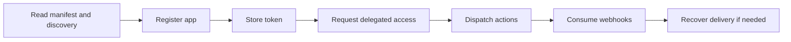

# Partner Quickstart

This quickstart is the fastest path to a working OpenSocial integration.

It assumes you are building a third-party app, service, or agent that wants to participate in the network through the public protocol.

## What you will accomplish

By the end of this path, you should be able to:

1. inspect the live protocol
2. register an app
3. authenticate with an issued token
4. request delegated access when needed
5. dispatch supported actions
6. receive events and handle delivery safely

## The integration path

## Step 1: understand the protocol

Read these first:

- [Protocol SDK index](./protocol-sdk-index)
- [Vision and purpose](./protocol-vision-and-purpose)
- [Protocol overview and exclusions](./protocol-overview-and-exclusions)
- [Manifest and discovery](./protocol-manifest-and-discovery)

## Step 2: register an app

Next, register your integration and securely store the issued token.

Primary guide:

- [App registration and tokens](./protocol-app-registration-and-tokens)

Repository example:

- `scripts/examples/protocol-partner-onboarding.mjs`

## Step 3: run the core actions flow

Once you have an app id and token, exercise the shipped write surface.

Primary guide:

- [External actions reference](./protocol-external-actions-reference)

Repository example:

- `scripts/examples/protocol-partner-actions.mjs`

## Step 4: add operational safety

Before you consider an integration production-ready, add:

- webhook verification
- delivery inspection
- replay
- recovery

Use:

- [Event subscriptions and replay](./protocol-event-subscriptions-and-replay)
- [Webhook consumer](./protocol-webhook-consumer)
- [Delivery recovery](./protocol-operator-recovery)

## Step 5: add agents only if you need them

If your integration includes an autonomous or semi-autonomous actor, use the agent layer on top of the same protocol boundary.

Use:

- [Agent integration paths](./protocol-agent-integration-paths)
- [Agent quickstart](./protocol-agent-quickstart)
- [Agent readiness](./protocol-agent-readiness)

## What success looks like

You are using the protocol as intended when:

- your integration starts from manifest and discovery
- your app token lifecycle is controlled
- delegated access is explicit
- your writes map to documented actions
- webhook replay and recovery are operational

## What not to do

Do not use the quickstart as an excuse to invent unsupported abstractions.

Specifically, do not model:

- posts
- follows
- likes
- feeds
- generic social timelines
