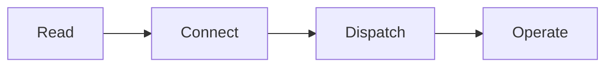
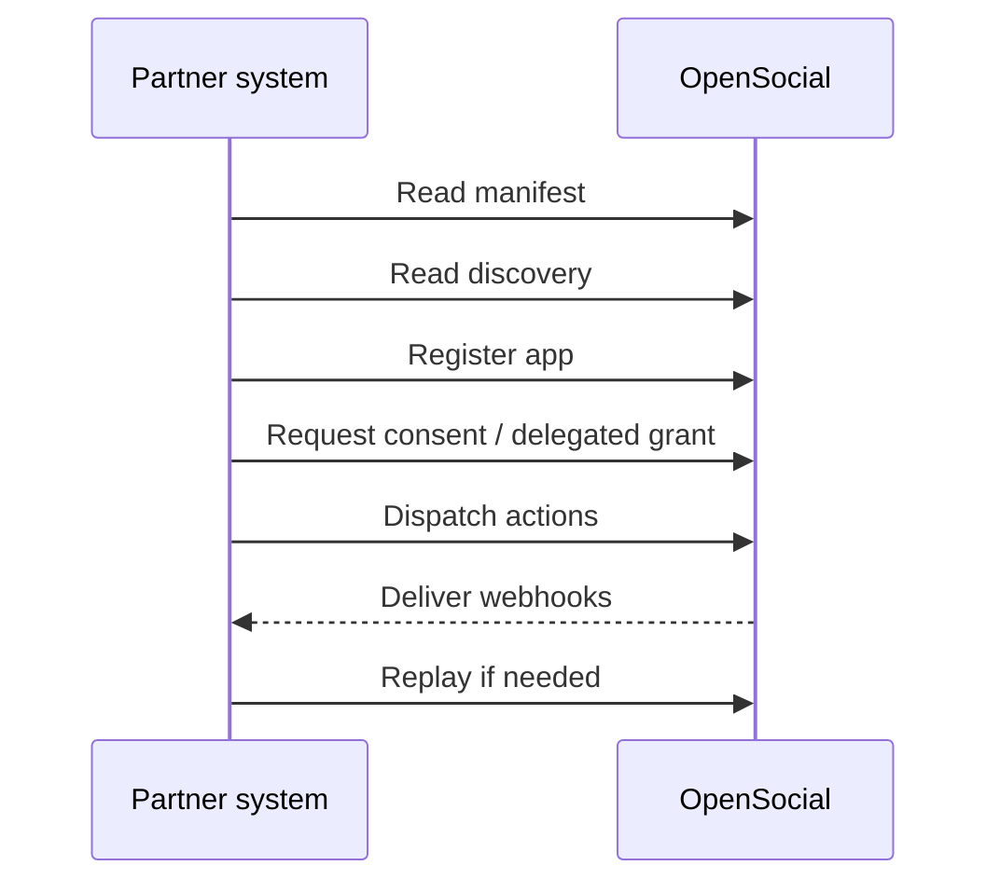

# Read, Connect, Dispatch, And Operate

This page is the shortest technical map of the OpenSocial integration lifecycle.

If you want the whole SDK shape on one page, start here.

## The lifecycle

## Read

Before you mutate anything, learn the live contract.

Use:

- manifest
- discovery

Why:

- confirm protocol identity
- inspect capabilities
- verify resources and action surface
- align your integration to the live environment

Primary guide:

- [Manifest and discovery](./protocol-manifest-and-discovery)

## Connect

After you understand the live contract, connect your app to it.

Use:

- app registration
- app token storage
- consent requests
- delegated grants where required

Why:

- keep auth explicit
- limit capability scope
- avoid private implementation assumptions

Primary guides:

- [App registration and tokens](./protocol-app-registration-and-tokens)
- [Consent and auth troubleshooting](./protocol-consent-and-auth-troubleshooting)

## Dispatch

Once the app is registered and authorized, use the stable action surface.

Today that includes:

- intent lifecycle
- request lifecycle
- chat send
- circle membership and lifecycle actions

Why:

- keep writes narrow
- preserve typed event history
- make partner behavior recoverable

Primary guide:

- [External actions reference](./protocol-external-actions-reference)

## Operate

Production integrations need more than successful responses.

Use:

- webhook delivery
- replay
- dead-letter recovery
- delivery inspection

Why:

- handle transient failures
- recover missed deliveries
- inspect live integration health

Primary guides:

- [Event subscriptions and replay](./protocol-event-subscriptions-and-replay)
- [Webhook consumer](./protocol-webhook-consumer)
- [Delivery recovery](./protocol-operator-recovery)

## Typical partner path

## Where agents fit

Agents are not a separate protocol.

They are a consumer of the same SDK boundary.

That means the correct order is:

1. learn the protocol
2. authenticate safely
3. dispatch through stable primitives
4. then layer agent wrappers on top

Primary guides:

- [Agent integration paths](./protocol-agent-integration-paths)
- [Agent quickstart](./protocol-agent-quickstart)
