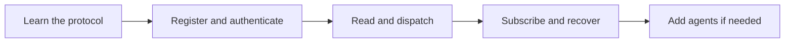

# OpenSocial Protocol SDK Index

Entry point for the OpenSocial protocol SDK docs.

Use this page when you want the shortest path to the right guide.

## Start here

If you are new to the protocol, use this order:

1. understand the protocol shape
2. bootstrap from manifest and discovery
3. register an app and store its token safely
4. choose the right integration layer
5. move into writes, webhooks, replay, or agent flows

That order matches the shipped contract and avoids unsupported assumptions.

## Core orientation

- vision and purpose:
  - [Protocol vision and purpose](./protocol-vision-and-purpose)
- overview and exclusions:
  - [Protocol overview and exclusions](./protocol-overview-and-exclusions)
- core concepts:
  - [Protocol core concepts](./protocol-core-concepts)
- manifest and discovery bootstrap:
  - [Protocol manifest and discovery](./protocol-manifest-and-discovery)
- app registration and tokens:
  - [Protocol app registration and tokens](./protocol-app-registration-and-tokens)

## Quickstart path

- partner quickstart:
  - [`/Users/cruciblelabs/Documents/openchat/docs/examples/protocol-partner-quickstart.md`](/Users/cruciblelabs/Documents/openchat/docs/examples/protocol-partner-quickstart.md)
- production checklist:
  - [`/Users/cruciblelabs/Documents/openchat/docs/examples/protocol-production-readiness-checklist.md`](/Users/cruciblelabs/Documents/openchat/docs/examples/protocol-production-readiness-checklist.md)
- compatibility and versioning:
  - [`/Users/cruciblelabs/Documents/openchat/docs/examples/protocol-versioning-and-compatibility.md`](/Users/cruciblelabs/Documents/openchat/docs/examples/protocol-versioning-and-compatibility.md)

## Action surface

- writable actions reference:
  - [`/Users/cruciblelabs/Documents/openchat/docs/examples/protocol-external-actions-reference.md`](/Users/cruciblelabs/Documents/openchat/docs/examples/protocol-external-actions-reference.md)
- consent and auth troubleshooting:
  - [`/Users/cruciblelabs/Documents/openchat/docs/examples/protocol-consent-and-auth-troubleshooting.md`](/Users/cruciblelabs/Documents/openchat/docs/examples/protocol-consent-and-auth-troubleshooting.md)

## Webhooks, replay, and recovery

- event subscriptions and replay:
  - [`/Users/cruciblelabs/Documents/openchat/docs/examples/protocol-event-subscriptions-and-replay.md`](/Users/cruciblelabs/Documents/openchat/docs/examples/protocol-event-subscriptions-and-replay.md)
- webhook consumer guide:
  - [`/Users/cruciblelabs/Documents/openchat/docs/examples/protocol-webhook-consumer.md`](/Users/cruciblelabs/Documents/openchat/docs/examples/protocol-webhook-consumer.md)
- operator recovery:
  - [`/Users/cruciblelabs/Documents/openchat/docs/examples/protocol-operator-recovery.md`](/Users/cruciblelabs/Documents/openchat/docs/examples/protocol-operator-recovery.md)

## Agent integrations

- agent integration paths:
  - [`/Users/cruciblelabs/Documents/openchat/docs/examples/protocol-agent-integration-paths.md`](/Users/cruciblelabs/Documents/openchat/docs/examples/protocol-agent-integration-paths.md)
- agent quickstart:
  - [`/Users/cruciblelabs/Documents/openchat/docs/examples/protocol-agent-quickstart.md`](/Users/cruciblelabs/Documents/openchat/docs/examples/protocol-agent-quickstart.md)
- agent readiness:
  - [`/Users/cruciblelabs/Documents/openchat/docs/examples/protocol-agent-readiness.md`](/Users/cruciblelabs/Documents/openchat/docs/examples/protocol-agent-readiness.md)
- agent toolset and toolkit:
  - [`/Users/cruciblelabs/Documents/openchat/docs/examples/protocol-agent-toolset.md`](/Users/cruciblelabs/Documents/openchat/docs/examples/protocol-agent-toolset.md)

## Package entry points

- protocol client:
  - [`/Users/cruciblelabs/Documents/openchat/packages/protocol-client/README.md`](/Users/cruciblelabs/Documents/openchat/packages/protocol-client/README.md)
- protocol server:
  - [`/Users/cruciblelabs/Documents/openchat/packages/protocol-server/README.md`](/Users/cruciblelabs/Documents/openchat/packages/protocol-server/README.md)
- protocol agent:
  - [`/Users/cruciblelabs/Documents/openchat/packages/protocol-agent/README.md`](/Users/cruciblelabs/Documents/openchat/packages/protocol-agent/README.md)
- protocol types:
  - [`/Users/cruciblelabs/Documents/openchat/packages/protocol-types/README.md`](/Users/cruciblelabs/Documents/openchat/packages/protocol-types/README.md)
- protocol events:
  - [`/Users/cruciblelabs/Documents/openchat/packages/protocol-events/README.md`](/Users/cruciblelabs/Documents/openchat/packages/protocol-events/README.md)

## Shipped example scripts

- onboarding:
  - [`/Users/cruciblelabs/Documents/openchat/scripts/examples/protocol-partner-onboarding.mjs`](/Users/cruciblelabs/Documents/openchat/scripts/examples/protocol-partner-onboarding.mjs)
- partner actions:
  - [`/Users/cruciblelabs/Documents/openchat/scripts/examples/protocol-partner-actions.mjs`](/Users/cruciblelabs/Documents/openchat/scripts/examples/protocol-partner-actions.mjs)
- webhook consumer:
  - [`/Users/cruciblelabs/Documents/openchat/scripts/examples/protocol-webhook-consumer.mjs`](/Users/cruciblelabs/Documents/openchat/scripts/examples/protocol-webhook-consumer.mjs)
- operations:
  - [`/Users/cruciblelabs/Documents/openchat/scripts/examples/protocol-partner-operations.mjs`](/Users/cruciblelabs/Documents/openchat/scripts/examples/protocol-partner-operations.mjs)
- partner agent:
  - [`/Users/cruciblelabs/Documents/openchat/scripts/examples/protocol-partner-agent.mjs`](/Users/cruciblelabs/Documents/openchat/scripts/examples/protocol-partner-agent.mjs)
- agent toolset:
  - [`/Users/cruciblelabs/Documents/openchat/scripts/examples/protocol-partner-agent-toolset.mjs`](/Users/cruciblelabs/Documents/openchat/scripts/examples/protocol-partner-agent-toolset.mjs)
- agent toolkit:
  - [`/Users/cruciblelabs/Documents/openchat/scripts/examples/protocol-partner-agent-toolkit.mjs`](/Users/cruciblelabs/Documents/openchat/scripts/examples/protocol-partner-agent-toolkit.mjs)

## Bottom line

The SDK is meant to be used as a coordination-first protocol surface:

- read the live contract
- register narrowly
- authenticate safely
- act through stable primitives
- recover through replay and queue tooling

If you find yourself trying to model posts, follows, feeds, likes, or a generic social graph, stop there. That is outside the intended SDK surface.
