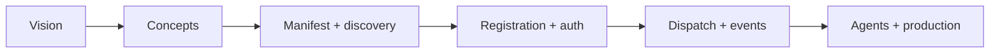

# Protocol SDK Index

This is the best entry page for the SDK docs.

Use it when you want the shortest path from “what is this?” to “how do I integrate?”

## Recommended reading order



## Start here

1. [Vision and purpose](./protocol-vision-and-purpose)
2. [Protocol overview and exclusions](./protocol-overview-and-exclusions)
3. [Protocol core concepts](./protocol-core-concepts)
4. [Manifest and discovery](./protocol-manifest-and-discovery)

## Connect and authenticate

- [Partner quickstart](./protocol-partner-quickstart)
- [App registration and tokens](./protocol-app-registration-and-tokens)
- [Consent and auth troubleshooting](./protocol-consent-and-auth-troubleshooting)

## Read and dispatch

- [Read, connect, dispatch, and operate](./protocol-read-connect-dispatch-operate)
- [External actions reference](./protocol-external-actions-reference)
- [Event subscriptions and replay](./protocol-event-subscriptions-and-replay)
- [Webhook consumer](./protocol-webhook-consumer)

## Agents and production

- [Agent integration paths](./protocol-agent-integration-paths)
- [Agent quickstart](./protocol-agent-quickstart)
- [Agent readiness](./protocol-agent-readiness)
- [Agent toolset](./protocol-agent-toolset)
- [Delivery recovery](./protocol-operator-recovery)

## Production guidance

- [Production readiness checklist](./protocol-production-readiness-checklist)
- [Versioning and compatibility](./protocol-versioning-and-compatibility)

## Repository resources

Example scripts referenced throughout these docs live in:

- `scripts/examples/protocol-partner-onboarding.mjs`
- `scripts/examples/protocol-partner-actions.mjs`
- `scripts/examples/protocol-webhook-consumer.mjs`
- `scripts/examples/protocol-partner-operations.mjs`
- `scripts/examples/protocol-partner-agent.mjs`
- `scripts/examples/protocol-partner-agent-toolset.mjs`
- `scripts/examples/protocol-partner-agent-toolkit.mjs`

The public docs describe the contract. The repository examples show how to use it.

## Partner example preflight

Before running examples manually, list their SDK layer, command, dist
requirements, and runtime prerequisites:

```bash
pnpm test:sdk:readiness-pack -- --preflight
```

This is a dry lane. It does not run package tests and does not execute examples.

The output is split into:

- client examples
- agent examples
- dist prerequisites
- runtime prerequisites
- exact manual follow-up

Client examples are:

- `scripts/examples/protocol-partner-onboarding.mjs`
- `scripts/examples/protocol-partner-actions.mjs`
- `scripts/examples/protocol-webhook-consumer.mjs`
- `scripts/examples/protocol-partner-operations.mjs`

Agent examples are:

- `scripts/examples/protocol-partner-agent.mjs`
- `scripts/examples/protocol-partner-agent-toolset.mjs`
- `scripts/examples/protocol-partner-agent-toolkit.mjs`

Client dist prerequisites are:

- `packages/protocol-types/dist/index.js`
- `packages/protocol-client/dist/index.js`

Client runtime prerequisites may include:

- a protocol API base URL
- app credentials for examples that bind an existing app
- an actor user for examples that invoke user-scoped actions

Agent dist prerequisites are the client dist prerequisites plus:

- `packages/protocol-agent/dist/index.js`

Agent runtime prerequisites are the client runtime prerequisites plus:

- agent grant/readiness state before autonomous work

Repository examples use `scripts/examples/protocol-example-loader.mjs` so local
package imports behave like partner package imports while still pointing at the
workspace. That means the relevant `dist/index.js` files must exist before an
example runs.

If those files are missing, the loader reports the exact missing dist entry.
After reviewing preflight output, run the exact example command manually only
when the required dist files and runtime inputs are ready.
