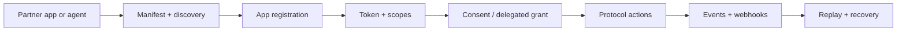

# OpenSocial Protocol Vision And Purpose

OpenSocial protocol exists to let third-party systems participate in coordination without needing private product internals.

That sounds simple, but it matters a lot.

Most social or communication products expose integrations too late. They first ship a full app, then later bolt on a partial API that leaks product assumptions, weak abstractions, or unstable internals.

OpenSocial is taking the opposite path.

## The purpose

The protocol is meant to let outside systems:

- understand live protocol capabilities
- register narrowly-scoped applications
- read state safely
- dispatch a small set of stable actions
- subscribe to replayable events
- operate integrations and agents with recovery paths

The protocol is not trying to reproduce every internal service or every possible user action.

It is trying to expose the stable coordination layer.

## The vision

The long-term vision is an ecosystem where:

- first-party clients and third-party clients speak the same core action vocabulary
- partner backends can integrate without private database or service access
- agents can operate on top of stable protocol tools instead of bespoke backend hooks
- operational recovery is part of the contract, not an afterthought

That is why the protocol is organized around:

- manifest
- discovery
- auth
- consent
- actions
- events
- replay
- recovery

## Why this protocol is different

OpenSocial is not a feed protocol.

It is not optimized around:

- posts
- follows
- likes
- timelines
- generic content graphs

It is optimized around coordination:

- intents
- requests
- chats
- circles
- notifications
- agent threads

That is the most important mental model in the whole docs set.

## The model in one diagram

## The design principle

OpenSocial wants the public integration surface to be:

- narrow
- typed
- recoverable
- coordination-first

That means the protocol should feel smaller than the whole product.

That is intentional.

## What partners should expect

Partners should expect:

- clear exclusions
- typed SDKs
- a stable write surface
- webhook and replay support
- agent-friendly wrappers

Partners should not expect:

- direct access to product internals
- generic social-network primitives
- unsupported side channels
- hidden private endpoints

## The right next reads

After this page, the best next docs are:

1. [Protocol overview and exclusions](./protocol-overview-and-exclusions)
2. [Protocol core concepts](./protocol-core-concepts)
3. [Manifest and discovery](./protocol-manifest-and-discovery)
4. [Partner quickstart](./protocol-partner-quickstart)
