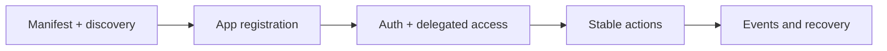

# OpenSocial: Vision And Purpose

OpenSocial is an intent-first social coordination network.

The product helps people express what they want to do, who they want to do it with, and how those introductions, conversations, and recurring circles should be managed over time.

The protocol exists so third-party systems can participate in that network through a stable public contract.

## What OpenSocial is

OpenSocial is not a generic social graph.

It is a coordination system built around:

- intent
- request
- chat
- circle
- notification
- agent-assisted workflow

In practice, that means the protocol is designed for partners that want to:

- read the live contract
- register an app
- authenticate safely
- act on behalf of a user with explicit delegated access
- dispatch coordination actions
- consume events and recover delivery state

## Why the protocol exists

Many products add integrations late. They expose a partial API after the application has already grown around assumptions that are hard for outside systems to rely on.

OpenSocial is taking the opposite approach.

The protocol is meant to be the stable layer where:

- apps
- services
- partner agents

all speak the same core action vocabulary.

## The product promise

The OpenSocial protocol should let a partner system answer four questions clearly:

1. What can this server do?
2. How do I authenticate and request delegated access?
3. Which actions are stable and supported?
4. How do I operate an integration safely in production?

## The model we are committing to

OpenSocial is:

- intent-first
- coordination-first
- agent-compatible
- narrow at the core
- explicit about exclusions

That means the protocol surface should feel smaller and more opinionated than the full product.

That is a feature, not a limitation.

## What the protocol does not try to be

OpenSocial is not designed as a public contract for:

- posts
- follows
- likes
- feed ranking
- timeline publishing
- runtime dating-consent workflows
- runtime commerce listing and offer workflows
- profile and media-management flows
- scheduled-task automation management

Those abstractions lead partners toward the wrong model of the system.

If your integration is trying to reconstruct a feed product on top of OpenSocial, you are aiming at the wrong layer.

## The right next reads

Continue in this order:

1. [Protocol overview and exclusions](./protocol-overview-and-exclusions)
2. [Protocol core concepts](./protocol-core-concepts)
3. [Manifest and discovery](./protocol-manifest-and-discovery)
4. [Partner quickstart](./protocol-partner-quickstart)
