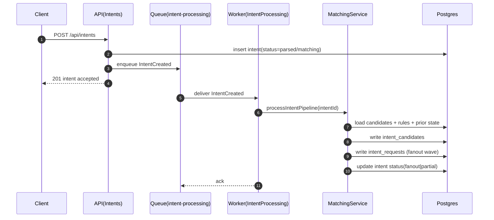
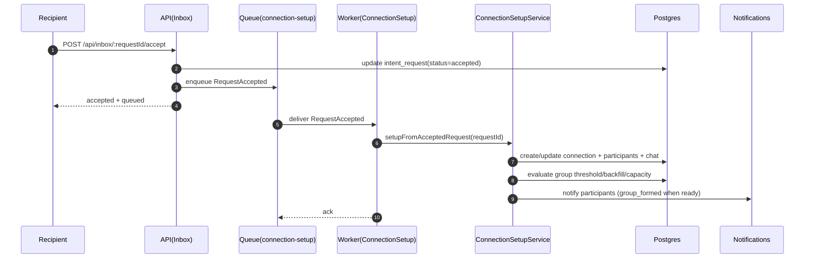
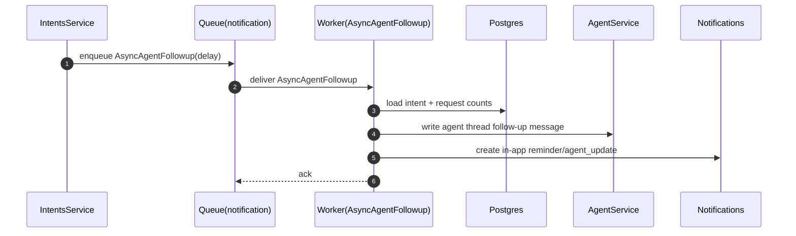
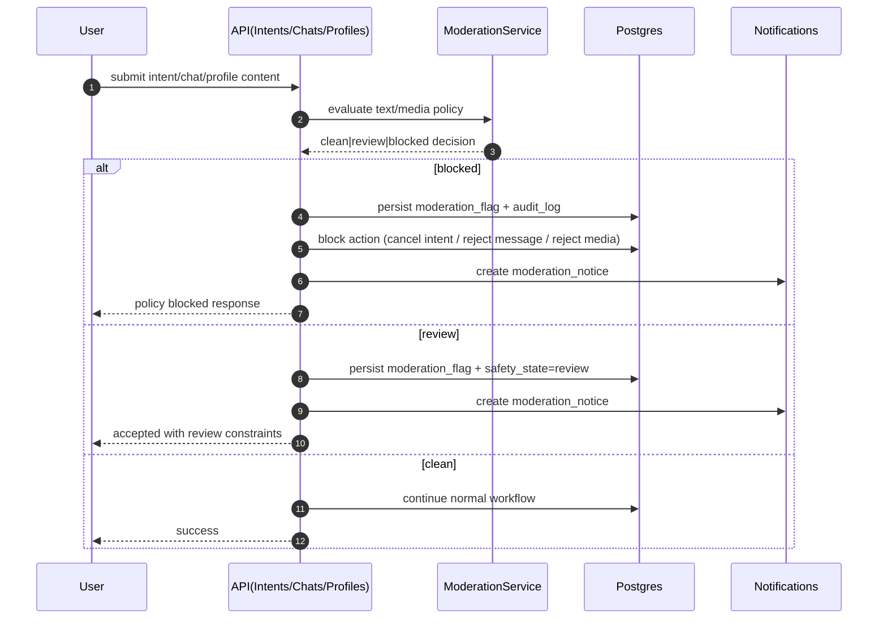

# Core Sequence Diagrams

## 1) Intent flow (create -> match -> request)

```mermaid
sequenceDiagram
  autonumber
  participant C as Client
  participant API as API(Intents)
  participant Q1 as Queue(intent-processing)
  participant W1 as Worker(IntentProcessing)
  participant M as MatchingService
  participant DB as Postgres

  C->>API: POST /api/intents
  API->>DB: insert intent(status=parsed/matching)
  API->>Q1: enqueue IntentCreated
  API-->>C: 201 intent accepted

  Q1->>W1: deliver IntentCreated
  W1->>M: processIntentPipeline(intentId)
  M->>DB: load candidates + rules + prior state
  M->>DB: write intent_candidates
  M->>DB: write intent_requests (fanout wave)
  M->>DB: update intent status(fanout|partial)
  W1-->>Q1: ack
```

## 2) Group formation (accept -> connection setup)

```mermaid
sequenceDiagram
  autonumber
  participant R as Recipient
  participant Inbox as API(Inbox)
  participant Q2 as Queue(connection-setup)
  participant W2 as Worker(ConnectionSetup)
  participant CS as ConnectionSetupService
  participant DB as Postgres
  participant N as Notifications

  R->>Inbox: POST /api/inbox/:requestId/accept
  Inbox->>DB: update intent_request(status=accepted)
  Inbox->>Q2: enqueue RequestAccepted
  Inbox-->>R: accepted + queued

  Q2->>W2: deliver RequestAccepted
  W2->>CS: setupFromAcceptedRequest(requestId)
  CS->>DB: create/update connection + participants + chat
  CS->>DB: evaluate group threshold/backfill/capacity
  CS->>N: notify participants (group_formed when ready)
  W2-->>Q2: ack
```

## 3) Agent async follow-up

```mermaid
sequenceDiagram
  autonumber
  participant API as IntentsService
  participant Q3 as Queue(notification)
  participant W3 as Worker(AsyncAgentFollowup)
  participant DB as Postgres
  participant A as AgentService
  participant N as Notifications

  API->>Q3: enqueue AsyncAgentFollowup(delay)
  Q3->>W3: deliver AsyncAgentFollowup
  W3->>DB: load intent + request counts
  W3->>A: write agent thread follow-up message
  W3->>N: create in-app reminder/agent_update
  W3-->>Q3: ack
```

## 4) Moderation pipeline

```mermaid
sequenceDiagram
  autonumber
  participant U as User
  participant API as API(Intents/Chats/Profiles)
  participant MOD as ModerationService
  participant DB as Postgres
  participant N as Notifications

  U->>API: submit intent/chat/profile content
  API->>MOD: evaluate text/media policy
  MOD-->>API: clean|review|blocked decision

  alt blocked
    API->>DB: persist moderation_flag + audit_log
    API->>DB: block action (cancel intent / reject message / reject media)
    API->>N: create moderation_notice
    API-->>U: policy blocked response
  else review
    API->>DB: persist moderation_flag + safety_state=review
    API->>N: create moderation_notice
    API-->>U: accepted with review constraints
  else clean
    API->>DB: continue normal workflow
    API-->>U: success
  end
```
